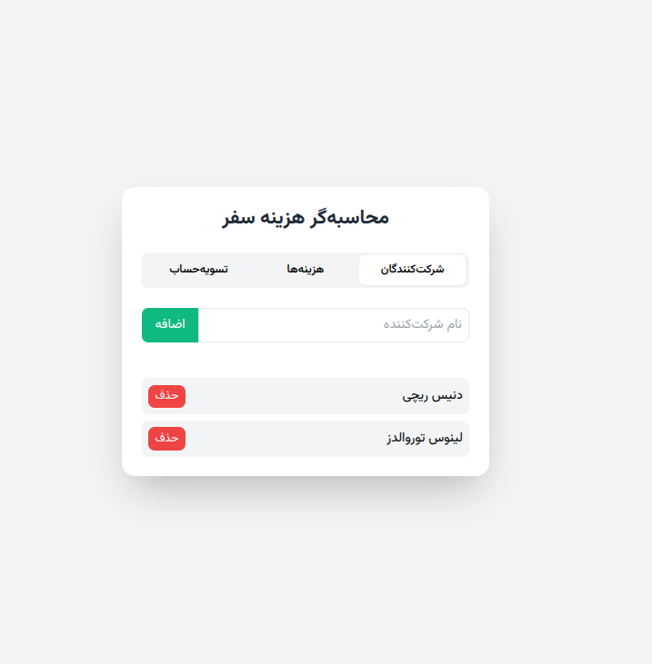

# Dongy (دانگی) 💰

> 🇮🇷 A modern expense splitting web app with Persian (Farsi) interface. Perfect for managing shared expenses during trips, gatherings, or roommate situations. No installation required - just open and use!

### ✨ Quick Features
- 🌐 Pure JavaScript - no backend required
- 💾 Local storage for data persistence
- 📱 Responsive design
- 📊 Smart settlement calculations
- 📥 Export to Excel/CSV

## Screenshots

## Features

- 👥 Add and manage multiple participants
- 💰 Track expenses with detailed descriptions
- 💸 Support for splitting expenses among selected participants
- 📊 Real-time settlement calculations
- 📱 Responsive design that works on all devices
- 💾 Local storage support to persist data
- 📥 Export functionality to Excel/CSV format
- 🇮🇷 Persian (Farsi) language interface

## Technology Stack

- HTML5
- CSS3 (with Tailwind CSS framework)
- Vanilla JavaScript
- Vazirmatn Font for Persian text rendering

## Usage

1. Open `index.html` in a web browser
2. Add participants using the "شرکت‌کنندگان" (Participants) tab
3. Record expenses in the "هزینه‌ها" (Expenses) tab:
   - Enter expense description
   - Enter amount in Tomans
   - Select who paid
   - Select who should share the expense
4. View settlements in the "تسویه‌حساب" (Settlement) tab
5. Export data to Excel/CSV if needed

## Features

### Participant Management
- Add and remove participants
- Automatic updates to expense sharing options

### Expense Tracking
- Detailed expense logging
- Flexible expense splitting
- Edit or delete existing expenses

### Settlement Calculation
- Automatic settlement calculations
- Shows who owes whom and how much
- Optimized transaction suggestions
- Export functionality for record keeping

## Local Storage

The application uses browser local storage to persist data, so your expense records will be saved even after closing the browser.

## License

This is an open-source project available for personal and commercial use.